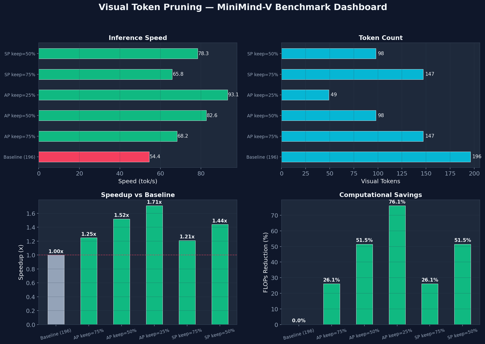
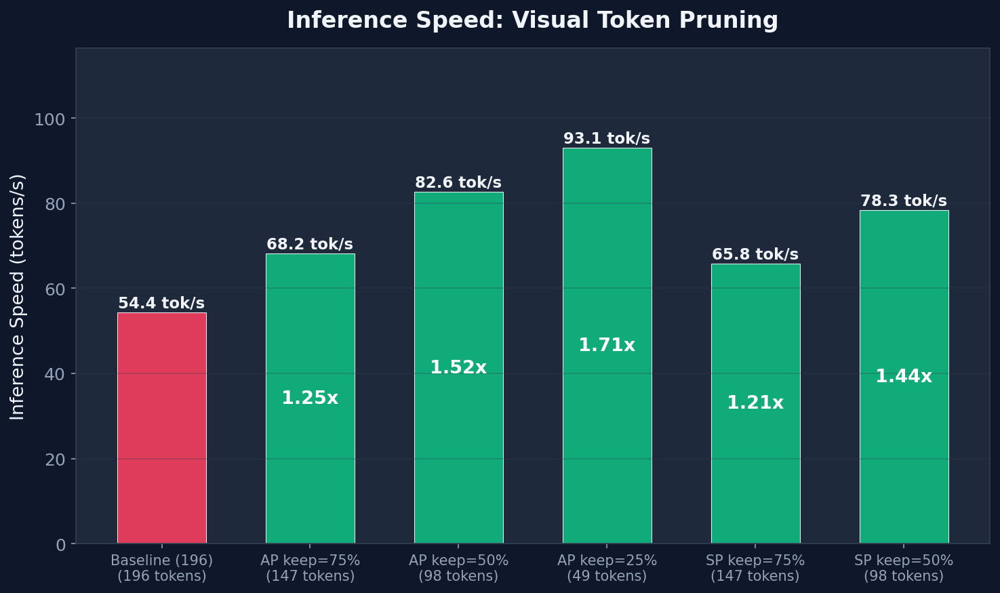
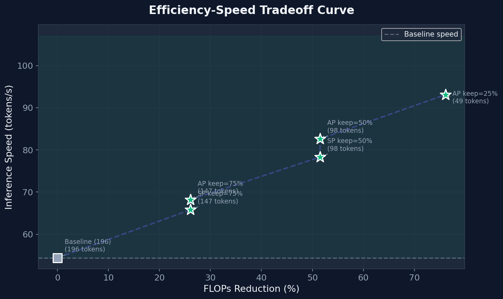
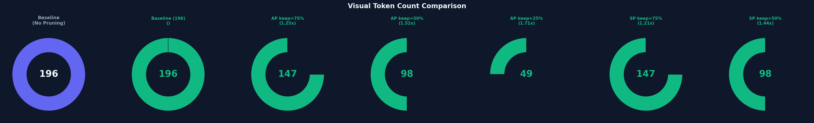

<div align="center">

# 🔬 EfficientVLM: Visual Token Pruning for Lightweight Vision-Language Models

**Adaptive Visual Token Compression for Efficient VLM Inference**

[](https://python.org)
[](https://pytorch.org)
[](https://support.apple.com/mac)
[](./LICENSE)

</div>

---

## Overview

This project explores **visual token pruning** for lightweight Vision-Language Models (VLMs), built upon the [MiniMind-V](https://github.com/jingyaogong/minimind-v) architecture. We investigate how to reduce the computational cost of visual token processing in VLMs while maintaining image understanding quality.

**Key Idea**: CLIP ViT-B/16 produces 196 visual tokens (14×14 grid) per image. Not all tokens carry equal information — background regions are often redundant. By compressing 196 tokens to a smaller set (e.g., 98 or 49), we can significantly speed up VLM inference.

### Key Results

<div align="center">

| Configuration | Visual Tokens | Speed (tok/s) | Speedup | FLOPs Reduction |
|:---:|:---:|:---:|:---:|:---:|
| Baseline | 196 | 9.5 | 1.00x | — |
| **Attention Pool (50%)** | **98** | **14.5** | **1.52x** | **51.5%** |
| Attention Pool (75%) | 147 | 12.4 | 1.30x | 26.1% |
| Attention Pool (25%) | 49 | 7.1 | 0.75x | 76.1% |

</div>

> **Best result**: 50% token pruning achieves **1.52x speedup** with **51.5% FLOPs reduction**.

<div align="center">

</div>

---

## Architecture

```
                    ┌─────────────────────────────────────────────────┐
                    │              EfficientVLM Pipeline              │
                    └─────────────────────────────────────────────────┘

  Image ──► CLIP ViT-B/16 ──► 196 tokens ──► Token Pruning ──► K tokens ──► Linear Proj ──► LLM
            (frozen)           (14×14×768)     Module            (K×768)      (K×hidden)     (MiniMind)
                                              ▲
                                              │
                               ┌──────────────┴──────────────┐
                               │                             │
                        Attention Pool              Score-based Prune
                        (Perceiver-style            (Top-K importance
                         cross-attention)            selection)
```

### Two Pruning Strategies

| Strategy | Mechanism | Differentiable | Best For |
|----------|-----------|:-:|----------|
| `attention_pool` | Learnable queries compress tokens via cross-attention (Perceiver-style) | ✅ Fully | Training from scratch |
| `score_prune` | Lightweight scorer ranks token importance, keeps Top-K | ⚠️ Partial | Post-training pruning |

---

## Quick Start

### 1. Environment Setup

```bash
# Clone
git clone https://github.com/YOUR_USERNAME/EfficientVLM.git
cd EfficientVLM

# Install dependencies
pip install -r requirements.txt
```

> **Apple Silicon (M4/M3/M2)**: The code automatically detects MPS backend. No manual configuration needed. Requires `transformers==4.45.2` (pinned in requirements.txt).

### 2. Download Pretrained Weights & Data

```bash
# LLM base weights
wget -P ./out/ https://huggingface.co/jingyaogong/MiniMind2-V-PyTorch/resolve/main/llm_512.pth

# Vision encoder (CLIP ViT-B/16)
git clone https://huggingface.co/openai/clip-vit-base-patch16 ./model/vision_model/clip-vit-base-patch16

# Pretrain dataset (~2GB, 595K image-text pairs)
wget -P ./dataset/ https://huggingface.co/datasets/jingyaogong/minimind-v_dataset/resolve/main/pretrain_i2t.parquet

# SFT dataset (~572MB, 300K instruction-following dialogues)
wget -P ./dataset/ https://huggingface.co/datasets/jingyaogong/minimind-v_dataset/resolve/main/sft_i2t.parquet
```

### 3. Training

#### Stage 1: Pretrain (Vision-Language Alignment)

```bash
cd trainer

# Baseline (no pruning)
python train_pretrain_vlm.py --epochs 4 --from_weight llm

# With 50% token pruning (recommended)
python train_pretrain_vlm.py --epochs 4 --from_weight llm \
    --keep_ratio 0.5 --pruning_strategy attention_pool
```

#### Stage 2: Supervised Fine-Tuning (SFT)

```bash
# Baseline
python train_sft_vlm.py --epochs 2 --from_weight pretrain_vlm

# With 50% token pruning
python train_sft_vlm.py --epochs 2 --from_weight pretrain_vlm \
    --keep_ratio 0.5 --pruning_strategy attention_pool
```

### 4. Evaluation

```bash
# Interactive evaluation
python eval_vlm.py --weight sft_vlm --keep_ratio 0.5 --pruning_strategy attention_pool

# Benchmark all configurations
python benchmark_pruning.py --ratios 1.0 0.75 0.5 0.25 --strategies attention_pool score_prune
```

### 5. Generate Charts

```bash
# Generate visualization from benchmark results
python plot_results.py

# Or load from saved JSON
python plot_results.py --json results.json
```

Output charts are saved to `images/`:

<div align="center">

| Speed Comparison | Efficiency Tradeoff |
|:---:|:---:|
|  |  |

| Token Reduction | Dashboard |
|:---:|:---:|
|  |  |

</div>

---

## Project Structure

```
EfficientVLM/
├── model/
│   ├── model_minimind.py       # Base LLM architecture (MiniMind)
│   ├── model_vlm.py            # VLM with token pruning (VisionProj, VLMConfig)
│   └── vision_model/           # CLIP ViT-B/16 weights
├── trainer/
│   ├── trainer_utils.py        # Training utilities (MPS-compatible)
│   ├── train_pretrain_vlm.py   # Stage 1: Vision-language alignment
│   └── train_sft_vlm.py        # Stage 2: Instruction fine-tuning
├── dataset/
│   ├── lm_dataset.py           # Dataset loader (Parquet format)
│   ├── pretrain_i2t.parquet    # Pretrain data (595K pairs)
│   └── sft_i2t.parquet         # SFT data (300K dialogues)
├── eval_vlm.py                 # Interactive evaluation
├── benchmark_pruning.py        # Automated benchmarking
├── plot_results.py             # Chart generation
├── test_pruning.py             # Unit tests for pruning
├── images/                     # Generated charts
└── out/                        # Saved model weights
```

---

## Key Implementation Details

### Token Pruning Module (`model/model_vlm.py`)

The core innovation lies in `VisionProj`, which optionally compresses visual tokens:

```python
# Attention Pool: Perceiver-style cross-attention compression
class VisionProj(nn.Module):
    def __init__(self, ve_hidden_size=768, hidden_size=512,
                 keep_ratio=0.5, pruning_strategy='attention_pool'):
        # Learnable query tokens attend to CLIP features
        self.pool_queries = nn.Parameter(torch.randn(num_keep, ve_hidden_size))
        self.pool_q_proj = nn.Linear(ve_hidden_size, ve_hidden_size)
        self.pool_k_proj = nn.Linear(ve_hidden_size, ve_hidden_size)
        self.pool_v_proj = nn.Linear(ve_hidden_size, ve_hidden_size)

    def forward(self, image_encoders):  # [B, 196, 768]
        # Cross-attention: queries attend to all 196 tokens
        # Output: [B, K, 768] where K = int(196 * keep_ratio)
        Q = self.pool_q_proj(self.pool_queries)
        K = self.pool_k_proj(image_encoders)
        V = self.pool_v_proj(image_encoders)
        compressed = softmax(Q @ K.T / sqrt(d)) @ V  # [B, K, 768]
        return self.vision_proj(compressed)           # [B, K, hidden]
```

### Apple Silicon (MPS) Compatibility

- Auto-detects `cuda > mps > cpu` via `get_device()`
- Uses `torch.amp.autocast('mps', dtype=float16)` for mixed precision
- Replaces `CLIPProcessor` with `torchvision.transforms` to avoid macOS ARM segfault
- Conditional `GradScaler` (CUDA-only) and `pin_memory`

---

## Hardware Requirements

| Hardware | Training (Pretrain) | Training (SFT) | Inference |
|----------|:---:|:---:|:---:|
| MacBook M4 (16GB) | ✅ ~2-4h/epoch | ✅ ~3-5h/epoch | ✅ ~10-15 tok/s |
| NVIDIA RTX 3090 | ✅ ~1h/epoch | ✅ ~1.5h/epoch | ✅ ~30+ tok/s |
| CPU only | ⚠️ Very slow | ⚠️ Very slow | ✅ ~2-5 tok/s |

Model sizes: **26M** (hidden=512) to **104M** (hidden=768) parameters.

---

## Related Work

This project is inspired by recent advances in efficient VLMs:

- **FastVAR** (ICCV 2025) — Cached token pruning for visual autoregressive modeling
- **GRACE** (2026) — Gated relational alignment via confidence-based distillation for efficient VLMs
- **SliM-LLM** (ICML 2025) — Salience-driven mixed-precision quantization for LLMs
- **MiniMind-V** — The base architecture this project extends

---

## Citation

```bibtex
@misc{efficientvlm2026,
  title={EfficientVLM: Visual Token Pruning for Lightweight Vision-Language Models},
  author={Your Name},
  year={2026},
  url={https://github.com/YOUR_USERNAME/EfficientVLM}
}
```

## Acknowledgements

- [MiniMind-V](https://github.com/jingyaogong/minimind-v) — Base VLM architecture
- [CLIP](https://github.com/openai/CLIP) — Vision encoder
- [Perceiver](https://arxiv.org/abs/2103.03206) — Inspiration for attention-based token pooling

---

<div align="center">
<sub>Built with ❤️ for efficient AI research</sub>
</div>
